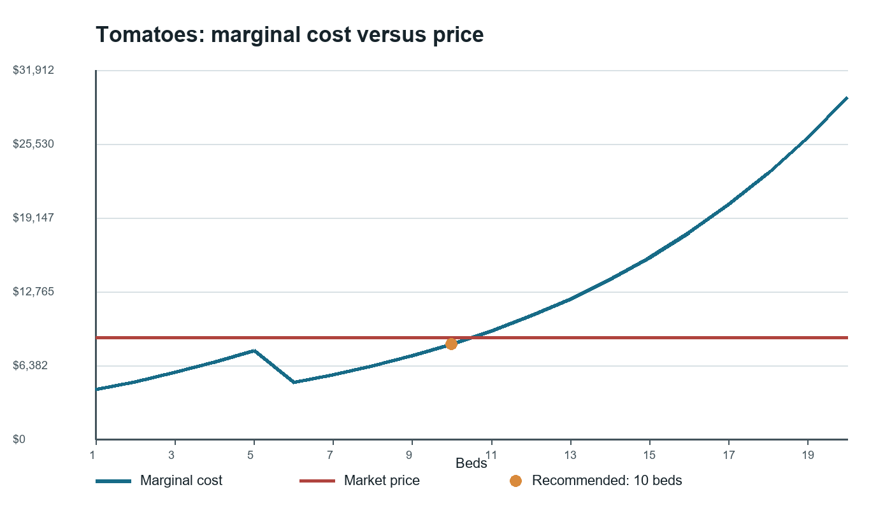
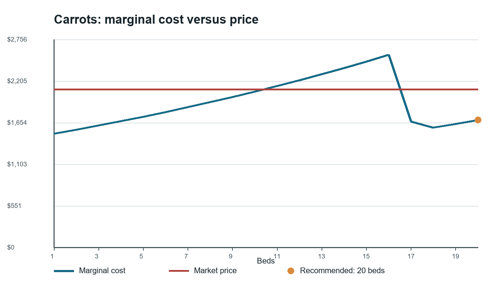
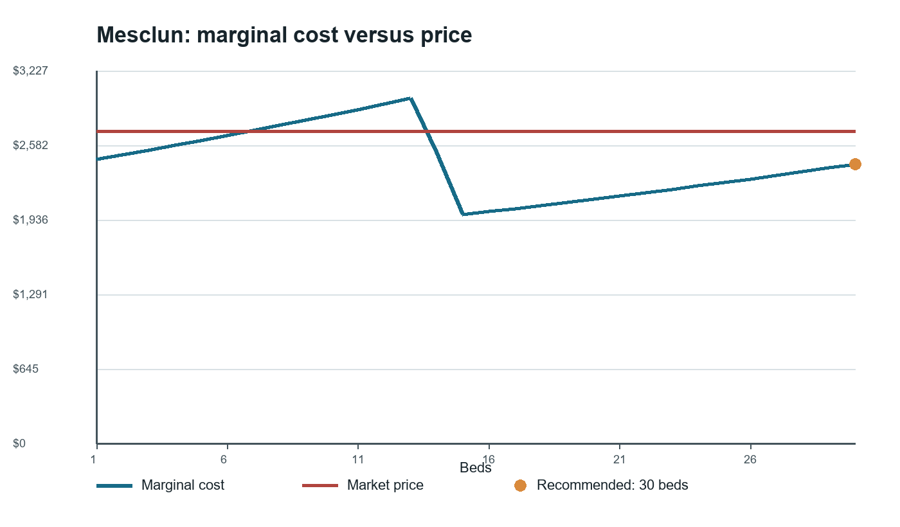

# Perfect Competition — findings

The profit-maximizing plan is 10 tomato beds, 20 carrot beds, and 30 mesclun beds. It uses 60 of the farm's 64 beds, requires 3.1647 temporary-worker equivalents, and produces season profit of $42,761.66 (`Optimization!F6:F12`). The result follows from three different stopping conditions: tomato marginal cost crosses price, carrots and mesclun reach their crop caps, and neither total land nor temporary labor is exhausted.

## Tomatoes stop when the next bed destroys value

The eleventh tomato bed costs $9,390.72 to produce but earns only $8,800, so planting it would reduce profit by $590.72. The tenth bed still adds value: its marginal cost is $8,248.59, leaving $551.41 between price and marginal cost (`Marginal Cost!E16:F17`; `Cost Structure!G4:H4`). Consistent with that crossing, farm profit falls from $42,761.66 at 10 tomato beds to $42,170.95 at 11 when carrots and mesclun remain at their recommended quantities (`Optimum Charts!D16:D17`).

Figure 1 makes the stopping rule visible: the flat $8,800 price line lies above tomato marginal cost through bed 10 and below it at bed 11. This is an economic limit, not a physical one. The model leaves four total beds unused and 10 beds of tomato capacity unused (`Optimization!B14:D15`).

*Figure 1. Tomato marginal cost versus the $8,800 market price. Source: `Marginal Cost!A7:F26`.*

## Crop caps bind before land or labor

The carrot and mesclun caps bind at 20 and 30 beds, respectively. Both have zero slack, while the farm has four beds and 0.8353 temporary-worker equivalents remaining (`Optimization!B14:D18`). The tomato cap is also slack by 10 beds, so relaxing total land, tomato capacity, or temporary labor would not improve the current solution.

Carrot marginal cost at bed 20 is $1,688.95, still $405.05 below its $2,094 price (`Marginal Cost!L26:M26`). Extending the same marginal-cost formula one bed beyond the cap gives an estimated cost of $1,741.51 for bed 21, so one additional permitted carrot bed would add about $352.49 to profit. Mesclun marginal cost at bed 30 is $2,420.10, still $279.90 below its $2,700 price (`Marginal Cost!S36:T36`). The corresponding estimate for bed 31 is $2,453.53, making one more permitted mesclun bed worth about $246.47. Those incremental values are the shadow values of the two binding crop-cap constraints. If additional crop-specific ground can be acquired at comparable cost, carrot capacity should be expanded first because its next bed has the larger expected contribution.

Figures 2 and 3 show why the model stops these crops for a different reason than tomatoes: at the selected quantities, both marginal-cost curves remain below their price lines.

*Figure 2. Carrot marginal cost versus the $2,094 market price. Source: `Marginal Cost!H7:M26`.*

*Figure 3. Mesclun marginal cost versus the $2,700 market price. Source: `Marginal Cost!O7:T36`.*

## The tomato marginal-cost dip comes from the wage switch

Tomato marginal cost does not rise continuously. It falls from $7,660.86 on bed 5 to $4,906.28 on bed 6, then rises to $5,585.71 on bed 7 (`Marginal Cost!E11:E13`). Diminishing returns have not reversed: total tomato labor rises from 724.73 hours at five beds to 956.64 hours at six (`Marginal Cost!B11:B12`). What changes is the price of the marginal hour. Five beds already cross the farmer's 720-hour allocation (`Inputs!B7`; `Marginal Cost!B11`). Additional hours then shift from the farmer's $34.72 hourly cost to the $17.36 temporary-labor cost (`Inputs!B10:B13`). That wage reduction briefly outweighs the extra hours caused by diminishing returns. Once the transition is absorbed, the 10% compounding labor penalty dominates and marginal cost rises through the price line, as Figure 1 shows.

## Positive contribution justifies crops that lose alone

Carrots and mesclun each report a loss when treated as a standalone business and charged the entire $20,000 fixed cost. At 20 beds, carrots generate $41,880 of revenue and $38,368.92 of standalone variable cost, which becomes a $16,488.92 loss after fixed cost (`Cost Structure!C5,B22`; `Marginal Cost!K26`). At 30 beds, mesclun generates $81,000 of revenue and $72,922.19 of standalone variable cost, a $11,922.19 loss after the same fixed cost (`Cost Structure!C6,B22`; `Marginal Cost!R36`).

That standalone view assigns the same farmwide fixed cost separately to each crop. The planting decision should instead ask whether price covers average variable cost and whether each additional bed adds contribution. Carrot average variable cost at its cap is $1,918.45 per bed, below the $2,094 price (`Marginal Cost!H26,K26,M26`). Mesclun average variable cost is $2,430.74 per bed, below the $2,700 price (`Marginal Cost!O36,R36,T36`). In the combined plan, carrots contribute $13,682.27 and mesclun $15,935.98 before the shared fixed cost (`Cost Structure!C5:F6`). Removing either crop because it cannot carry all fixed cost alone would discard positive contribution toward a cost the farm pays once.

## Comparison with the Stage 1 hypothesis

In Stage 1, I predicted 14 tomato, 20 carrot, and 30 mesclun beds, using all 64 available beds. The model instead selects 10, 20, and 30 beds (`Optimization!B6:B8`) and leaves four beds unused (`Optimization!D14`). I correctly expected carrots and mesclun to reach their caps and tomatoes to stop before theirs, but I underestimated how quickly the tomato labor penalty would push marginal cost above price: bed 10 costs $8,248.59, while bed 11 costs $9,390.72 against an $8,800 price (`Marginal Cost!E16:F17`). I also expected marginal cost to rise continuously and missed the temporary dip created when labor switches from the farmer's $34.72 rate to the $17.36 temporary rate (`Inputs!B10:B13`). My prior therefore got both the timing and the shape of tomato marginal cost wrong, leading me to predict four unprofitable tomato beds and a binding land constraint when leaving those beds empty maximizes profit.
