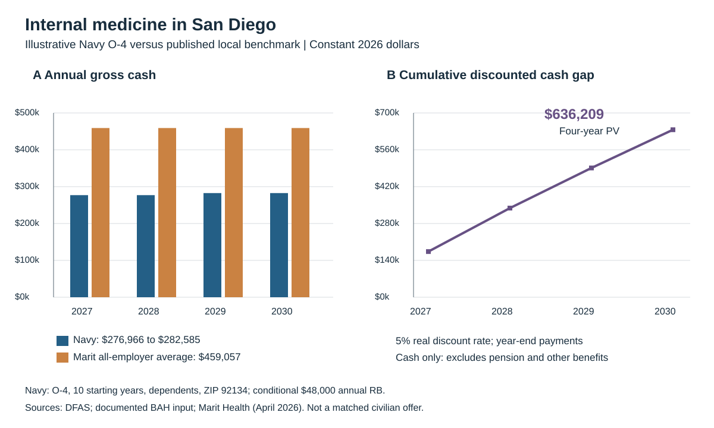

# The Financial Opportunity Cost of Continued Navy Service for Primary-Care Physicians

James M. Day
September 19, 2026
BUS 620 — Micro and Macro Economics
Individual Research Paper — A Global Challenge, Analyzed

<!-- PAGE BREAK -->

## Purpose and Research Question

The U.S. Navy Medical Corps needs a clear understanding of the financial alternatives facing physicians at retention decisions. Using general internal medicine in San Diego as the primary example, the relevant question is: **How much financial compensation does a physician forgo by remaining in the Navy over the next four years rather than accepting a feasible civilian position?**

This paper estimates that difference to inform retention strategy for primary-care physicians. The findings can help the Medical Corps evaluate advocacy for larger retention bonuses, targeted advertising of existing nonfinancial benefits, and shifting appropriate primary-care clinical work toward advanced practice providers. The analysis measures a financial incentive; it does not identify an optimal bonus, predict retention, or establish the most cost-effective staffing mix.

The information need is supported by the U.S. Government Accountability Office (GAO, 2020). Its comparison of 2017 compensation found maximum military cash compensation below the civilian median in 21 of 27 medical and dental specialties reviewed. GAO recommended collecting civilian wage, bonus-acceptance, and replacement-cost information to inform incentive decisions. GAO also identified civilian cash advantages at key retention points, including completion of initial active-duty obligations. Those historical, department-wide findings motivate this analysis; they do not establish a current Navy primary-care pay gap.

The civilian alternative is itself under pressure. Grumbach et al. (2021) call for rebuilding primary-care infrastructure, while Hoffer (2024) discusses relative compensation and administrative demands. Song and Zhu (2025) describe movement toward concierge and direct primary care, and Bitton and Rouleau (2023) report organizational and staffing challenges in *NEJM Catalyst*. These perspectives provide context, not estimates of Navy retention effects. They also caution against assuming that a higher-paying civilian position necessarily offers better working conditions.

## Economic Framework

Opportunity cost is the value of the best forgone alternative. For this paper, the **financial opportunity cost of staying** is operationalized as the difference between the present value of a feasible civilian career path and continued Navy service over the same horizon. A positive difference indicates a civilian financial advantage. The current calculation isolates gross cash compensation, so its results are a **partial estimate of financial opportunity cost**, not a complete valuation of either career.

The decision is marginal: compare the consequences of the next period of service with the alternative available at that decision date (Frank et al., 2022, pp. 5–8). Medical-school support already received is sunk. Future compensation, additional service obligations, retirement accrual, and working conditions remain relevant. A civilian attending position is a valid comparator only if the physician can separate, is qualified for that position, and can realistically obtain it. A physician who still needs residency training requires a different comparison.

Compensating wage differentials explain why cash pay alone need not determine a career choice. Physicians may value mission, camaraderie, teaching, leadership, research, and operational practice differently. These job attributes can influence preferences, but the cash gap does not measure their value. Pension, health coverage, and funded educational benefits belong in the financial comparison rather than being labeled nonfinancial compensation.

Labor-market theory helps explain why outside opportunities matter, but a compensation gap does not reveal retention responsiveness (Frank et al., 2022, pp. 376–385). This paper therefore does not apply a general officer elasticity to forecast Navy physician retention.

## Method and Assumptions

The primary scenario is a board-certified Navy O-4 general internist just past 10 years of service, with dependents, assigned to duty-station ZIP 92134 in San Diego. This is a representative profile chosen for analysis, not an observed average Navy internist. The four-year horizon covers 2027–2030 using constant 2026 dollars. Rank remains O-4; basic pay advances from the over-10 rate in years 1–2 to the over-12 rate in years 3–4. No real salary growth or promotion is assumed.

The comparison uses a **5 percent real discount rate and year-end payments** throughout the paper and the lab's cash calculation. For each year t, the discounted gap is (civilian cash minus Navy cash) / 1.05^t, with t = 1, 2, 3, 4. Sensitivity at 3 and 7 percent is reported separately. The rate is an analytical assumption, not an estimated physician preference (Frank et al., 2022; Warner & Pleeter, 2001).

| Navy component | Annual amount in 2027–2028 | Annual amount in 2029–2030 |
| --- | ---: | ---: |
| Basic pay | $113,040.00 | $118,659.60 |
| BAH with dependents | $60,984.00 | $60,984.00 |
| BAS | $3,941.76 | $3,941.76 |
| Incentive pay | $43,000.00 | $43,000.00 |
| Board-certification pay | $8,000.00 | $8,000.00 |
| Assumed eligible four-year retention agreement | $48,000.00 | $48,000.00 |
| Total gross Navy cash | $276,965.76 | $282,585.36 |

*Table 1. Itemized scenario. Basic-pay inputs are $9,420 and $9,888.30 per month; BAS is $328.48 per month (Defense Finance and Accounting Service [DFAS], 2026a, 2026b). BAH is the lab's $5,082 monthly San Diego input, which requires a final official rate/individual-entitlement check (Defense Travel Management Office, n.d.). IP, BCP, and RB match the published FY26 DoD table, but that table specifies maximum allowed amounts and directs readers to the service for its rates (DFAS, 2026c). The $48,000 RB is conditional on an eligible Navy agreement; this is not verification of an individual entitlement.*

The San Diego comparator is Marit Health's published all-employer internist average of **$459,057**, on a page updated April 30, 2026 and accessed September 19, 2026 (Marit Health, 2026). This mixed-employer, self-reported benchmark is not a verified civilian-only offer or an estimate matched to this officer's experience. Its preview includes a military contractor and different career stages. It is used as a transparent local scenario, held fixed in real terms, rather than as proof of the best feasible civilian alternative.

The original fixed $239,000 Navy total and unverified three-specialty salary figures are superseded for the current analysis. A final individual comparison still requires the officer's actual entitlements and a comparable civilian offer. Salary matching should account for hours, call, practice setting, experience, location, and employer-paid benefits.

### Retirement, benefits, and additional work

A fuller comparison should add the difference in after-tax financial benefits and employment costs to the cash comparison. BAH and BAS receive federal income-tax exclusions, so equal gross cash need not mean equal take-home compensation (Internal Revenue Service, 2025, Table 2). Use the same household assumptions on both paths, including civilian employer retirement contributions, health coverage, and any physician-paid malpractice or transition costs. Do not count employer-provided coverage twice or add an employee's own retirement savings as extra employer compensation.

Pension analysis requires a separate career-stage scenario. Starting at 10 active-service years and completing four more does not meet the usual 20-year active-duty retirement threshold (Department of Defense, n.d.). No pension payment is included in this four-year cash table; that is not a claim that continued service has no future pension value. A longer career-path sensitivity must model reaching eligibility, the retirement system, High-3 basic pay, payment duration, and the alternative separation or Reserve path, using the same 5 percent real discount assumption. High-36 uses a 2.5 percent annual service multiplier and BRS uses 2 percent, applied to the applicable retired basic-pay base; BRS also includes government retirement-account contributions subject to its rules (Department of Defense, n.d.). Special pays and housing allowances should not be treated as pensionable basic pay. Record retirement-creditable service separately from the years used for the pay table.

For a physician not yet retirement-eligible, value the future benefits under each feasible path, including the additional service required and uncertainty about reaching eligibility. A four-year horizon that ends before retirement must either remain explicitly a cash-only comparison or include a justified end-of-horizon value for later benefits. A million-dollar pension valuation at retirement cannot simply be subtracted from today's four-year cash gap (Schofer, 2016; author's analytical application).

For someone already eligible to retire, the civilian path may include both civilian earnings and an immediately payable military pension. Continued service can increase later retired pay while delaying pension receipts; both effects belong in the comparison. This differs fundamentally from leaving before pension eligibility (Morgan, 2013). Pension amounts, health benefits, and taxes must be valued consistently without counting the same future payments twice.

Moonlighting should be a separate scenario on both career paths. Model feasible hours, approval and availability, taxes, and physician-paid expenses, including applicable malpractice coverage. It involves additional labor and cannot be treated as a guaranteed Navy-paid benefit or assumed to continue through deployment or reassignment (Schofer, 2026). If household finances are analyzed, changes in a spouse's earnings or relocation expenses should also be shown separately.

HPSP, HSCP, and USUHS articles address the earlier decision to enter military medicine. Their tuition and training benefits should not be added again as new compensation for a physician deciding whether to remain after completing an obligation. Existing service commitments still determine when separation is feasible, and any newly incurred commitment belongs in the future comparison. The analysis should therefore distinguish accession, training, initial-obligation completion, and retirement decisions.

The conditional pension sensitivity in Appendix B quantifies how the pension component changes with proximity to eligibility; it is kept separate from the four-year cash gap.

## Results

| Year | Navy gross cash | San Diego benchmark | Annual gross gap | Discounted gap at 5% |
| --- | ---: | ---: | ---: | ---: |
| 2027 | $276,965.76 | $459,057.00 | $182,091.24 | $173,420.23 |
| 2028 | $276,965.76 | $459,057.00 | $182,091.24 | $165,162.12 |
| 2029 | $282,585.36 | $459,057.00 | $176,471.64 | $152,442.84 |
| 2030 | $282,585.36 | $459,057.00 | $176,471.64 | $145,183.65 |
| Four-year total | $1,119,102.24 | $1,836,228.00 | $717,125.76 | $636,208.84 |

*Table 2. Calculations from Table 1 and the Marit benchmark. Positive gaps favor the benchmark financially. Present values use unrounded amounts; annual rounded values can differ from the rounded total by one cent.*

*Figure 1. Navy O-4 general-internist scenario versus the published San Diego internist benchmark. Panel A compares annual cash; Panel B accumulates the annual cash differences discounted at 5 percent to the decision date. The figure excludes taxes, pension, TSP, health coverage, and other benefit differences. The market series is a mixed-employer benchmark, not a matched civilian offer. Sources: DFAS (2026a–2026c), the documented BAH input, Marit Health (2026), and calculations in Tables 1–2.*

Figure 1 shows that the longevity step narrows the annual gap in 2029, while the cumulative discounted cash difference remains positive and reaches approximately $636,209. This is a conditional cash comparison, not a retention prediction or a valuation of all financial benefits.

| Real discount rate | Four-year present-value cash gap |
| --- | ---: |
| 3% sensitivity | $666,715 |
| 5% base case | $636,209 |
| 7% sensitivity | $607,907 |

*Table 3. Discount-rate sensitivity with the same compensation inputs and year-end timing.*

At 5 percent, a $10,000 change in annual benchmark compensation changes the four-year present value by approximately $35,460. With no renewed $48,000 annual RB, the modeled Navy cash falls by that amount each year and the present-value gap rises by approximately $170,206. Contract eligibility and benchmark comparability therefore matter independently of the discount-rate assumption.

## Initial Policy Recommendation

The author's selected initial policy is a limited Medical Corps social-media and advertising campaign emphasizing accessible nonfinancial benefits. The working rationale is that using existing communication channels may be relatively inexpensive and straightforward to implement; the paper has not established that it is the cheapest option. Record staff time, content production, approvals, distribution costs, and evaluation costs before making that comparison. Targeted advertising or career counseling could describe real opportunities for operational practice, teaching, leadership, research, and mission-focused service to physicians approaching a retention decision. Messages should identify eligibility, availability, selection requirements, and associated commitments.

First-person accounts describe both attractive opportunities and costs such as deployments, relocation, reduced control over assignments, and administrative duties (Dahle, 2024, 2025; Patterson, 2024). These accounts help identify topics for interviews or surveys; they do not establish how common each experience is or how much Navy primary-care physicians value it. Targeting should reflect expressed preferences and accessible opportunities, with candid discussion of the associated burdens.

Separate financial-benefit counseling from advertising nonfinancial job attributes. Counseling can explain pay eligibility, application steps, tax treatment, and retirement consequences. Accurate information may improve a physician's understanding of the compensation already available, but that is different from increasing compensation.

Such communication addresses an information gap only when physicians are unaware of opportunities they can actually access and value. It does not reduce the financial gap or create unavailable assignments. The analysis cannot establish that a particular nonfinancial benefit offsets the modeled internal-medicine cash gap. Those preferences require separate evidence.

The research literature also examines job attributes directly. Warner and Goldberg's (1984) Navy-enlisted study considers sea duty in labor-supply analysis; it should not be interpreted as a physician valuation of mission or evidence that advertising improves retention. Mundell (2010) brings clinical practice opportunities into physician-retention research. Together, these sources motivate collecting information about actual assignments and practice conditions, alongside pay, when evaluating the Navy career proposition.

These findings also imply that communication should be paired with assessment of actual working conditions. Where clinicians identify excessive administrative work, inadequate staffing, poor schedule predictability, or limited voice in decisions, the Medical Corps should evaluate operational improvements alongside its messaging. Advertising an attractive mission does not remedy those problems. This is a policy implication of the literature, not a demonstrated retention effect of a particular workplace reform.

Bonus advocacy and communication can be complementary. A larger bonus changes financial compensation; accurate advertising helps physicians understand the existing job attributes. Whether either approach improves retention, and for whom, remains a question for evaluation.

The strongest objection is that physicians already know the benefits and leave because of pay or inaccessible opportunities; advertising could then accomplish little. A limited pilot should measure baseline awareness, actual access to advertised opportunities, agreement acceptance, and later retention against standard communication. Clicks and views alone are not retention outcomes. If awareness rises without improved acceptance or retention, or if the advertised opportunities are unavailable, revise or stop the campaign and evaluate operational improvements or financial incentives instead. The recommendation is to test a potentially inexpensive first step, not to infer that messaging compensates for the cash gap.

## Limitations and Further Evaluation

The itemized scenario improves traceability but remains conditional on Navy pay eligibility and a comparable local alternative. The calculation omits differences in income and payroll taxes, pension value, retirement contributions, health coverage, educational benefits, malpractice costs, and other employment expenses. Their net effect could narrow or widen the measured gap. A complete comparison should value only financial consequences that differ between staying and leaving, including future retirement consequences of the decision, without counting already earned benefits twice.

The fixed O-4 profile cannot represent all career stages. A published San Diego mixed-employer benchmark also cannot establish an individual's best feasible local alternative. Neither the compensation table nor its sensitivity calculations demonstrate a separation rate, a causal retention effect, or an operational-readiness loss. The model also contains no advanced-practitioner compensation or staffing-outcome data, so that policy option remains a proposal for separate evaluation.

Before using the estimates for policy advocacy, the Medical Corps would need validated compensation components and comparable civilian alternatives by specialty and career stage. Evaluation of a subsequent bonus or communication initiative should then track baseline agreement acceptance, actual retention, costs, and access to advertised opportunities. A credible comparison group and attention to concurrent assignment or pay changes are needed to distinguish an intervention's effect from other influences. Increased awareness alone would not establish improved retention.

Burnout, satisfaction, intention to leave a practice, and actual separation from military service are distinct outcomes. News reports can identify concerns but should not be used as measured Navy attrition rates. Evaluation should distinguish leaving a clinic, reducing hours, leaving military service, and leaving medicine; record burnout and working conditions alongside subsequent personnel outcomes; and examine differences by specialty, career stage, family circumstances, and installation. Any analysis of sensitive characteristics should use appropriate privacy protections and report aggregate findings.

## Conclusion

The O-4 internal-medicine scenario produces a four-year gross-cash gap of approximately $636,209 in present value at 5 percent against the published San Diego benchmark. The estimate excludes pension and other financial differences and remains conditional on Navy agreement eligibility and benchmark comparability.

The author's initial policy choice is to test targeted social-media and advertising communication of real, accessible nonfinancial benefits. Its presumed ease and lower implementation cost are hypotheses to measure. Retention bonuses, improved working conditions, and staffing changes remain alternatives if communication does not improve actual career decisions.

<!-- PAGE BREAK -->

## References

- Agarwal, S. D., Pabo, E., Rozenblum, R., & Sherritt, K. M. (2020). Professional dissonance and burnout in primary care: A qualitative study. *JAMA Internal Medicine, 180*(3), 395–401. https://doi.org/10.1001/jamainternmed.2019.6326

- Antao, V., Krueger, P., Meaney, C., Kwong, J. C., & White, D. (2026). Predictors of burnout among academic family medicine faculty: Looking back to plan forward. *PLOS ONE, 21*(4), e0344702. https://doi.org/10.1371/journal.pone.0344702

- Bitton, A., & Rouleau, K. (2023). Primary care is essential and under siege. *NEJM Catalyst Innovations in Care Delivery, 4*(7). https://doi.org/10.1056/CAT.23.0175

- Bureau of Medicine and Surgery (BUMED). (2022). *Navy active component Medical Corps special pay guidance*, Table 2, pp. 10–11. [Document hosted by MCCareer](https://mccareer.org/wp-content/uploads/2022/02/fy22-mc-special-pay-guidance-final.pdf).

- Bureau of Medicine and Surgery (BUMED). (2025). *Navy active component Medical Corps special pay guidance*, Tables 2–3, pp. 11–12. [Document hosted by MCCareer](https://mccareer.org/wp-content/uploads/2024/09/fy25-mc-special-pay-guidance.pdf).

- Calkins, A., Mattock, M. G., Donofry, S. D., Schwam, D., Lawrence, A., & Hepner, K. A. (2025). Cost trade-offs between accessing and retaining uniformed mental health providers. *RAND Health Quarterly, 12*(2), 6. https://pmc.ncbi.nlm.nih.gov/articles/PMC11916088/

- Chan, E. W., Mattock, M. G., Tong, P. K., Hanser, L. M., Panis, C., & Baker, S. (2024). *Reimagining the Army Medical Corps: Five ideas for raising recruitment, restoring retention, and restructuring requirements* (RR-A2119-1). RAND. https://www.rand.org/pubs/research_reports/RRA2119-1.html

- Chief of Naval Operations. (2025, November 18). *FY26 Medical Department officer special pays for active duty* (NAVADMIN 229/25). [Message hosted by MCCareer](https://mccareer.org/wp-content/uploads/2025/11/nav25229.pdf).

- Chief of Naval Personnel. (n.d.). *Military couple and single parent assignment policy* (MILPERSMAN 1300-1000). [Navy personnel manual](https://www.mynavyhr.navy.mil/Portals/55/Reference/MILPERSMAN/Documents/Whole%20MILPERSMAN.pdf). Accessed September 19, 2026.

- Clotfelter, C., Glennie, E., Ladd, H., & Vigdor, J. (2008). Would higher salaries keep teachers in high-poverty schools? Evidence from a policy intervention in North Carolina. *Journal of Public Economics, 92*(5–6), 1352–1370. https://scholars.duke.edu/publication/1060909

- Dahle, J. M. (2024, May 27). *10 reasons to thank military docs for their service*. The White Coat Investor. https://www.whitecoatinvestor.com/sacrifices-military-doctors/

- Dahle, J. M. (2025, May 17). *Life as a military physician—10 things I loved about being a military doctor*. The White Coat Investor. https://www.whitecoatinvestor.com/10-things-i-loved-about-being-a-military-doctor/

- Defense Finance and Accounting Service. (2026a). *Basic allowance for subsistence*. Retrieved September 19, 2026, from https://www.dfas.mil/militarymembers/payentitlements/Pay-Tables/BAS/

- Defense Finance and Accounting Service. (2026b). *Basic pay: Commissioned officers*. Retrieved September 19, 2026, from https://www.dfas.mil/MilitaryMembers/payentitlements/Pay-Tables/Basic-Pay/CO/

- Defense Finance and Accounting Service. (2026c). *Medical Corps board certification pay, incentive pay and retention bonus, FY 2026*. Retrieved September 19, 2026, from https://www.dfas.mil/MilitaryMembers/payentitlements/Pay-Tables/HPO4/

- Defense Health Agency. (2026, August 25). *Graduate medical education application information: Service and service obligation*. https://www.health.mil/Reference-Center/Frequently-Asked-Questions/DHA-GME-Application-Info-Service-and-Service-Obligation

- Defense Travel Management Office. (n.d.). *BAH rate lookup*. Retrieved September 19, 2026, from https://www.travel.dod.mil/Allowances/Basic-Allowance-for-Housing/BAH-Rate-Lookup/

- Department of Defense. (n.d.). *Military retirement*. [Retirement plans and formulas](https://militarypay.defense.gov/Pay/Retirement/). Retrieved September 19, 2026.

- Department of Defense Office of Inspector General. (2025, June 13). *Evaluation of DoD efforts to assign medical personnel to locations where they can maintain wartime readiness skills and core competencies* (DODIG-2025-114). [Public recommendations record](https://www.oversight.gov/reports/audit/evaluation-dod-efforts-assign-medical-personnel-locations-where-they-can-maintain).

- Flaherty, E., & Bartels, S. J. (2019). Addressing the community-based geriatric healthcare workforce shortage by leveraging the potential of interprofessional teams. *Journal of the American Geriatrics Society, 67*(S2), S400–S408. https://doi.org/10.1111/jgs.15924

- Frank, R. H., Bernanke, B. S., Antonovics, K., & Heffetz, O. (2022). *Principles of economics: A streamlined approach* (4th ed.). McGraw Hill.

- Gotz, G. A., & McCall, J. J. (1984). *A dynamic retention model for Air Force officers: Theory and estimates* (R-3028-AF). RAND. https://www.rand.org/pubs/reports/R3028.html

- Grumbach, K., Bodenheimer, T., Cohen, D., Phillips, R. L., Stange, K. C., & Westfall, J. M. (2021). Revitalizing the U.S. primary care infrastructure. *New England Journal of Medicine, 385*, 1156–1158. https://doi.org/10.1056/NEJMp2109700

- Hoffer, E. P. (2024). Primary care in the United States: Past, present and future. *The American Journal of Medicine, 137*(8), 702–705. https://doi.org/10.1016/j.amjmed.2024.03.012

- Hosek, J., Nataraj, S., Mattock, M. G., & Asch, B. J. (2017). *The role of special and incentive pays in retaining military mental health care providers* (RR-1425-OSD). RAND. https://www.rand.org/pubs/research_reports/RR1425.html

- Internal Revenue Service. (2025). *Publication 3: Armed Forces' tax guide*, Table 2. https://www.irs.gov/publications/p3

- Keating, E. G., Brauner, M. K., Galway, L. A., Mele, J. D., Burks, J. J., & Saloner, B. (2009). *Air Force physician and dentist multiyear special pay: Current status and potential reforms* (MG-866). RAND. https://www.rand.org/content/dam/rand/pubs/monographs/2009/RAND_MG866.pdf

- Korona-Bailey, J., Janvrin, M. L., Shaw, L., & Koehlmoos, T. P. (2024). Assessing mid-career female physician burnout in the military health system: Finding joy in practice after the COVID-19 pandemic. *BMC Public Health, 24*, 862. https://doi.org/10.1186/s12889-024-18357-5

- Lee, J., & Kontopantelis, E. (2024). A systematic review exploring the factors that contribute to increased primary care physician turnover in socio-economically deprived areas. *PLOS ONE, 19*(12), e0315433. https://doi.org/10.1371/journal.pone.0315433

- Liu, C.-F., Hebert, P. L., Douglas, J. H., Neely, E. L., Sulc, C. A., Reddy, A., Sales, A. E., & Wong, E. S. (2020). Outcomes of primary care delivery by nurse practitioners: Utilization, cost, and quality of care. *Health Services Research, 55*(2), 178–189. https://doi.org/10.1111/1475-6773.13246

- Mani, V., Pomer, A., Pritchett, S., Coles, C. L., Schoenfeld, A. J., Weissman, J. S., & Koehlmoos, T. P. (2024). Filling the gaps in the COVID-19 pandemic response: Medical personnel in the US military health system. *BMC Health Services Research, 24*, 1140. https://doi.org/10.1186/s12913-024-11616-6

- Marit Health. (2026, April 30). *Internist salary in San Diego, CA*. Retrieved September 19, 2026, from https://www.marithealth.com/o/-/internist/salary/san-diego-ca

- Mattock, M., & Arkes, J. (2007). *The dynamic retention model for Air Force officers: New estimates and policy simulations of the Aviator Continuation Pay Program* (TR-470-AF). RAND. https://www.rand.org/content/dam/rand/pubs/technical_reports/2007/RAND_TR470.pdf

- Morgan, G. (2013, August 23). *Stay in the military or retire after 20 years?* The White Coat Investor. https://www.whitecoatinvestor.com/stay-or-go-at-20-years-military-physician-series/

- Morgan, P. A., Abbott, D. H., McNeil, R. B., & Fisher, D. A. (2012). Characteristics of primary care office visits to nurse practitioners, physician assistants and physicians in United States Veterans Health Administration facilities, 2005 to 2010: A retrospective cross-sectional analysis. *Human Resources for Health, 10*, 42. https://doi.org/10.1186/1478-4491-10-42

- Morgan, P. A., Smith, V. A., Berkowitz, T. S. Z., Edelman, D., Van Houtven, C. H., Woolson, S. L., Hendrix, C. C., Everett, C. M., White, B. S., & Jackson, G. L. (2019). Impact of physicians, nurse practitioners, and physician assistants on utilization and costs for complex patients. *Health Affairs, 38*(6), 1028–1036. https://doi.org/10.1377/hlthaff.2019.00014

- Mundell, B. F. (2010). *Retention of military physicians: The differential effects of practice opportunities across the three services* (RGSD-275) [Doctoral dissertation, Pardee RAND Graduate School]. https://www.rand.org/pubs/rgs_dissertations/RGSD275.html

- MyNavy HR. (n.d.). *Career Intermission Program*. https://www.mynavyhr.navy.mil/Career-Management/Reserve-Personnel-Mgmt/IRR/Career-Intermission/ Retrieved September 19, 2026.

- Naval Medical Leader and Professional Development Command. (n.d.). *Full-Time Outservice (FTOS) and Other Federal Institution (OFI) programs*. https://www.med.navy.mil/Naval-Medical-Leader-and-Professional-Development-Command/Professional-Development/Graduate-Medical-Education/FTOS-OFI/ Retrieved September 19, 2026.

- Okpalauwaekwe, U., MacPhee, B. K., Balezantis, L., Ramsden, V. R., & Baerwald, A. (2026). To stay or leave: An integrative review of factors, personas, and recommendations for retaining family physicians in Canada. *BMC Primary Care, 27*, 6. https://doi.org/10.1186/s12875-025-03128-x

- Patterson, C. (2024, March 15). *What it's like to be a military doctor—and is it the right path for you?* The White Coat Investor. https://www.whitecoatinvestor.com/military-doctor/

- Rodney, D. (2017). *Navy manpower planning*, references 42–43 (CPP-2017-U-015038-Final). CNA. https://www.cna.org/reports/2017/CPP-2017-U-015038-Final.pdf

- Schofer, J. (2016, March 20). *How valuable is a military pension?* MCCareer. https://mccareer.org/2016/03/20/how-valuable-is-a-military-pension/

- Schofer, J. (2020a, December 1). *How much do you get paid as a Navy doctor?* MCCareer. https://mccareer.org/2020/12/01/how-much-do-you-get-paid-as-a-navy-doctor/

- Schofer, J. (2020b, February 27). *FY20 special pays plan released*. MCCareer. https://mccareer.org/2020/02/27/fy20-special-pays-plan-released/

- Schofer, J. (2026, August 22). *Moonlighting tips for officers in Navy Medicine*. MCCareer. https://mccareer.org/2026/08/22/moonlighting-tips-for-officers-in-navy-medicine/

- Schuett, D. (2022, August 9). *How much do military doctors make?* The White Coat Investor. https://www.whitecoatinvestor.com/how-much-do-military-doctors-make/

- Song, Z., & Zhu, J. M. (2025). Primary care—from common good to free-market commodity. *New England Journal of Medicine, 392*, 1977–1979. https://doi.org/10.1056/NEJMp2501717

- U.S. General Accounting Office. (1994, October 14). *Aviation continuation pay: Some bonuses are inappropriate because of prior service obligations* (GAO/NSIAD-95-30). https://www.govinfo.gov/content/pkg/GAOREPORTS-NSIAD-95-30/html/GAOREPORTS-NSIAD-95-30.htm

- U.S. Government Accountability Office. (2018). *Military personnel: Collecting additional data could enhance pilot retention efforts* (GAO-18-439). https://www.gao.gov/products/gao-18-439

- U.S. Government Accountability Office. (2020). *Defense health care: DOD should collect and use key information to make decisions about incentives for physicians and dentists* (GAO-20-165). https://www.gao.gov/products/gao-20-165 Recommendation status, including June 2026 updates, reviewed September 19, 2026.

- U.S. Government Accountability Office. (2021). *Science and technology: Strengthening and sustaining the federal science and technology workforce* (GAO-21-461T). https://www.gao.gov/assets/gao-21-461t.pdf

- U.S. Government Accountability Office. (2025a). *Cyber workforce: Actions needed to improve size and cost data* (GAO-25-107405). https://files.gao.gov/reports/GAO-25-107405/index.html

- U.S. Government Accountability Office. (2025b). *Defense health care: Information needed to improve monitoring of military personnel staffing at medical facilities* (GAO-25-106988). https://www.gao.gov/products/gao-25-106988

- U.S. Government Accountability Office. (2026). *Defense health care: Actions needed to assess civilian partnerships' contributions to readiness* (GAO-26-107677). https://files.gao.gov/reports/GAO-26-107677/index.html

- Vie, L. L., Whittaker, K. S., Lathrop, A. D., & Hawkins, J. N. (2024). Examining retention sentiments and attrition among active duty Army medical officers. *Military Medicine, 189*(Suppl 3), 39–46. https://doi.org/10.1093/milmed/usae037

- Warner, J. T., & Goldberg, M. S. (1984). The influence of non-pecuniary factors on labor supply: The case of Navy enlisted personnel. *The Review of Economics and Statistics, 66*(1), 26–35. https://doi.org/10.2307/1924692

- Warner, J. T., & Pleeter, S. (2001). The personal discount rate: Evidence from military downsizing programs. *American Economic Review, 91*(1), 33–53. https://doi.org/10.1257/aer.91.1.33

- Wilk, J. E., Clarke-Walper, K., Nugent, K., Hoge, C. W., Sampson, M., & Warner, C. H. (2023). Associations of health care staff burnout with negative health and organizational outcomes in the U.S. military health system. *Social Science & Medicine, 330*, 116049. https://doi.org/10.1016/j.socscimed.2023.116049

- Wojcik, B. E., Stein, C. R., Guerrero, K., Hosek, B. J., Humphrey, R. J., & Soderdahl, D. W. (2020). Army physician career satisfaction based on a Medical Corps survey. *Military Medicine, 185*(7–8), e1200–e1208. https://doi.org/10.1093/milmed/usz480

<!-- PAGE BREAK -->

## Appendix A Supporting Literature and Policy Context

### Evidence and Source Selection

MCCareer provides Navy-specific pay announcements and links to guidance; White Coat Investor provides physician perspectives and financial examples. These sources help identify relevant components and decision constraints, but blog commentary is not a substitute for the applicable Navy pay plan or a comparable civilian compensation dataset. The accompanying [source-review record](navy-physician-source-review.md) documents the supplied links, their relevance, and retrieval limitations.

Two prominent salary examples require particular caution. Schofer's December 2020 illustration uses FY20 emergency-medicine pay and San Diego housing allowances with dependents; it is not a current primary-care benchmark. Dahle's 2024 comparison of approximately $177,000 in military pay with $363,000 in civilian pay pairs a constructed military example with an all-physician civilian average, rather than matching specialty and career stage. Neither supplies the current O-4 scenario's inputs. Schuett's 2022 discussion of GAO data also differentiates junior and senior officers; historical findings about all specialties should not be presented as a universal current primary-care shortfall (Schofer, 2020a; Dahle, 2024; Schuett, 2022).

### Relationship to established retention models

The calculation belongs to a long-standing literature comparing military and civilian career values. Annualized Cost of Leaving (ACOL) models express the financial advantage of continuing service rather than leaving immediately as an annual equivalent, considering possible future separation dates. A dollar-equivalent preference, or “taste,” for service is a separate behavioral component. The Dynamic Retention Model (DRM), presented by Gotz and McCall (1984), models successive stay-or-leave decisions under uncertainty; later applications address multiyear commitments and the value of retaining future choices (Mattock & Arkes, 2007).

This paper estimates neither model. It compares two fixed four-year cash streams without estimating preferences, future separation choices, or retention probabilities. Its civilian-minus-Navy gap also uses the opposite sign from a financial advantage of staying. Closing that gap is an accounting benchmark, not an estimate of a physician's taste for service or minimum acceptable bonus.

Warner's early contributions include distinct 1979 and 1981 reports, rather than two dates for one publication. CNA's bibliography identifies *Models of Retention Behavior* (July 1979) and *Military Compensation and Retention: An Analysis of Alternative Models and a Simulation of a New Retention Model* (August 1981, CRC 436). Original full-text retrieval was unsuccessful, so this paper does not assign a definitive first-development year to ACOL (Rodney, 2017, references 42–43).

### Evidence specific to military clinicians

Earlier physician research underscores the importance of career stage. Keating et al. (2009) found different multiyear-special-pay acceptance patterns among Air Force physicians becoming eligible at different points in their careers. Mundell's (2010) three-service physician dissertation examined practice opportunities and retention. These studies motivate measuring eligibility, training history, and actual clinical opportunities rather than treating physicians as a uniform labor pool.

Hosek et al. (2017) adapted the DRM to multiyear special pays for military mental-health-care providers. Calkins et al. (2025) examined accession-versus-retention cost tradeoffs for uniformed mental-health providers, including nurse practitioners. They provide precedents for profession-specific career-pay and staffing analysis, not transferable retention coefficients for Navy primary care.

The closest institutional comparison is Chan et al. (2024), which examines five Army Medical Corps options: increasing ancillary and administrative support, expanding military–civilian partnerships, widening ways to serve, expanding Army-sponsored graduate medical education, and reshaping community hospitals. The report distinguishes partnerships for clinical experience from service arrangements that include civilian employment. These are proposals with limited effectiveness data, not a list of proven or universally implemented policies. Because structural changes take time, RAND identifies monetary incentives as the most direct near-term instrument for encouraging continued service. Its Army findings do not establish an optimal Navy bonus or the effectiveness of the three policies considered here.

### Working conditions, burnout, and observed separation

Recent Army evidence links stated concerns with actual departures. Vie et al. (2024) studied 1,198 Medical Corps and 1,016 Nurse Corps officers responding to a voluntary career survey during 2020–2023. Family well-being and deployment effects were prominent reasons to leave, and the combined leave-reason score was associated with subsequent voluntary separation. This is stronger evidence of behavioral relevance than intentions alone, but remains observational and Army-specific. Wojcik et al.'s (2020) cross-sectional survey of 2,050 Army physicians likewise found that career satisfaction varied with rank, training status, and workplace.

Military burnout studies identify additional conditions worth measuring. Korona-Bailey et al. (2024) interviewed 22 mid-career female military physicians: pride in service coexisted with administrative and electronic-record burdens and concerns about leadership support. Wilk et al. (2023) examined military and civilian staff at Army installations and linked burnout with workload, work–life concerns, and adverse health outcomes. Mani et al. (2024), interviewing 28 MHS stakeholders about the pandemic response, identified staffing, hiring, and training-readiness challenges. These studies do not establish current Navy primary-care prevalence or a causal effect of any proposed intervention.

Civilian evidence similarly connects professional fulfillment with practice conditions. Agarwal et al. (2020) identified a mismatch between clinicians' professional values and workplace demands in interviews and focus groups with 26 primary-care practitioners. Antao et al. (2026) found associations with workplace quality, hours, and mentorship among University of Toronto family-medicine faculty; importantly, that study used a 2011 survey. Lee and Kontopantelis's (2024) systematic review of 13 studies in deprived areas and Okpalauwaekwe et al.'s (2026) integrative review of 23 Canadian studies identify financial, professional, family, and community considerations. These findings inform variables to investigate, rather than values to insert into the Navy cash-gap calculation.

### What the published Navy guidance establishes

The FY25 Navy Medical Corps guidance documents the following annual special pays for eligible, fully qualified physicians on four-year retention agreements (BUMED, 2025, Tables 2–3, pp. 11–12):

| Specialty | Incentive pay | Board-certification pay | Four-year agreement: annual retention bonus | Combined annual special pays |
| --- | ---: | ---: | ---: | ---: |
| Family medicine | $43,000 | $8,000 | $48,000 | $99,000 |
| General internal medicine | $43,000 | $8,000 | $40,000 | $91,000 |
| Pediatrics | $43,000 | $8,000 | $35,000 | $86,000 |

*Historical FY25 benchmark, not total salary or verified FY26 rates. Totals are author's sums and exclude basic pay and allowances. IP and BCP are paid monthly; RB is paid annually. Actual eligibility and agreements govern payment.*

The historical table is retained for context and is not the current scenario's pay baseline.

NAVADMIN 229/25 announces FY26 special-pay authority and directs officers to corps-specific guidance; it does not supply rates. The FY26 Medical Corps PDF returned an access error during this review, so FY25 values have not been relabeled as FY26 inputs. The current scenario separately checks the published DoD FY26 table and remains conditional on the Navy agreement. A final individual estimate must verify the applicable agreement, effective dates, and Navy rates, rather than substitute DoD ceilings or proposed legislation (Chief of Naval Operations, 2025).

### Existing Policy Context: Incentives, Obligations, and Clinical Capacity

The Navy's available tools extend beyond a retention bonus. Financial incentives, selected training opportunities, assignment policies, and alternative staffing arrangements affect different parts of the stay-or-leave decision. Their existence does not establish that they have produced additional voluntary retention. The relevant comparison is between a proposed change and the compensation, commitments, and opportunities already available to an eligible physician.

**Financial incentives and training.** Incentive pay, board-certification pay, and an eligible retention bonus belong in the itemized Navy cash baseline; a proposed bonus increase must be measured above that baseline. Pension consequences belong in a separate decision-date valuation, rather than being added to annual cash as though they were current salary. Accession and medical-school benefits already received do not become new retention compensation.

Navy graduate medical education includes selected Full-Time Outservice (FTOS) and Other Federal Institution (OFI) opportunities, with selection tied to published training goals (Naval Medical Leader and Professional Development Command, n.d.). DHA guidance states that military GME creates obligations that may run concurrently or consecutively with other commitments (Defense Health Agency, 2026). Consequently, training can offer professional development while changing the feasible separation date. A fellowship scenario should model training-period pay, specialty qualification, civilian training alternatives, and the actual obligation schedule; it should not assume that every fellowship adds the same number of years or guarantees retention through retirement. Service completed under a new obligation should be distinguished from voluntary continuation after it expires.

**Assignment and family considerations.** Navy-wide policies include military-couple co-location and a Career Intermission Program, subject to their governing eligibility and approval requirements. Co-location is constrained by Navy needs and does not generally provide assignment near a civilian spouse; career intermission includes a return-service obligation (Chief of Naval Personnel, n.d.; MyNavy HR, n.d.). Such policies may affect career feasibility, but are not guaranteed physician benefits or demonstrated Navy primary-care retention interventions. The family and assignment concerns identified in the Army literature motivate evaluating access to these options, predictability, and spouse-employment consequences rather than assuming that policy availability resolves the underlying problem.

**Staffing and clinical currency.** Civilian and contract employees augment military medical facilities. GAO (2025b) describes a collaborative staffing process but identifies incomplete and inaccurate information about personnel's available facility work time. Filling a billet therefore differs from providing dependable clinical capacity. Alternatives such as greater APP participation should be assessed against both beneficiary care and military readiness requirements, including how clinical and operational duties are distributed.

Military–civilian partnerships also provide skills-sustainment opportunities. GAO (2026) found incomplete partnership inventories and incomplete assessment of their clinical-readiness contributions. Partnerships can therefore be considered alongside appropriate military clinical assignments, but should not be described as proven retention solutions. Evaluation should account for the tradeoff between time spent maintaining skills outside a military facility and time available to its patients.

The DoD Inspector General's 2025 evaluation also recommended that Army and Navy assignment policies use wartime-readiness information and clarify the priority of military–civilian partnership locations. It recommended assessing facility capacity and partnership performance (Department of Defense Office of Inspector General, 2025). These publicly documented recommendations support evaluating assignment quality and clinical opportunity; they do not measure a retention effect.

**Unresolved incentive-evaluation data.** GAO's recommendation record for its 2020 compensation report still lists all three recommendations as open. In the June 2026 update, DOD reported that the needed replacement-cost, retention, and civilian-wage information required alternative collection methods and that contractor funding was unavailable; it estimated implementation by September 2028 (GAO, 2020, recommendation status reviewed September 19, 2026). This is a projected completion date, not completed implementation. The gaps limit a consistent assessment of the incentive package's effectiveness and investment value; they do not establish that every incentive lacks evidence or is ineffective.

This policy landscape supports evaluating compensation together with job design, professional development, and family circumstances. Assessing the relative contribution of each policy requires specialty- and career-stage-specific evidence on uptake, additional service, costs, and outcomes. The paper therefore treats the adequacy of bonuses and complementary reforms as questions for evaluation.

### Informing retention-bonus advocacy

The pay history reinforces the need to identify the agreement being modeled. The FY20 announcement removed four-year RB options for these primary-care specialties while preserving existing agreements; FY22 guidance restored four-year options. Later increases do not establish that the civilian gap disappeared or that retention improved. Authorized ceilings, funded Navy rates, eligibility, and actual payments are different quantities (Schofer, 2020b; BUMED, 2022).

A documented cash gap gives the Medical Corps a transparent basis for explaining the financial tradeoff physicians face. It can support evaluation of higher bonuses, but does not by itself establish the bonus amount required for retention.

For illustration, an additional $25,000 per year would reduce the first-year internal-medicine gap from $182,091 to $157,091, closing approximately 14 percent. Four such year-end payments have a present value of approximately $88,649 at 5 percent, leaving a four-year cash gap of approximately $547,560. A fixed nominal bonus would need conversion to real dollars before comparison.

This is an arithmetic scenario, not a recommendation that $25,000 is optimal. Assessing a policy requires eligible-physician counts, agreement uptake, additional physicians retained, and costs of alternative staffing approaches. Spending on physicians who would remain without a larger bonus also matters. The relevant policy comparison is the marginal cost per additional physician retained and the value of that retention, not simply the share of a salary gap closed.

Historical aviation evidence illustrates two evaluation problems. GAO (2018) found that services invoked airline demand when discussing pilot retention but lacked adequate information on post-service employment; its recommendation record also documents subsequent survey improvements. GAO (1994) found that 58 percent and 69 percent of new aviation-bonus contracts in FY92 and FY93, respectively, involved existing service commitments. Overlap does not prove a contract induces no additional service, but it requires distinguishing payment coverage from additional service obtained. This is separate from excluding an expired bonus from projected physician pay.

### Evaluating a greater role for advanced practice providers

A third policy option is to shift a greater share of appropriate primary-care clinical positions and responsibilities toward nurse practitioners and physician assistants, while retaining physicians for functions that require their expertise and for military readiness requirements. This would address the cost of providing clinical capacity as well as the challenge of retaining physicians.

The economic hypothesis is that Navy compensation for these advanced practice providers may be closer to their civilian alternatives, making competitive compensation more attainable than closing physician pay gaps. This possibility requires a separate military–civilian compensation comparison for each profession; the physician results in this paper do not establish it. A lower civilian salary alone would not demonstrate either a smaller military–civilian gap or lower total staffing costs.

VA research provides a basis for testing this option. Liu et al. (2020) studied patients reassigned after their physician left VA practice in 2010–2012. Their difference-in-differences analysis found lower utilization among NP-assigned patients, with no statistically significant differences in measured costs or clinical outcomes. This supports feasibility in the studied setting, not proven cost savings or universal clinical equivalence.

Morgan et al. (2019) found adjusted total costs approximately 6–7 percent lower for NP- and PA-managed VA patients with complex diabetes than for physician-managed patients. This observational association should not become an assumed Navy savings rate. An earlier study found that NPs and PAs handled roughly 30 percent of the studied VHA primary-care encounters during 2005–2010 (Morgan et al., 2012). That is historical evidence of substantial use, not a current staffing statistic. Adult VA evidence does not establish pediatric suitability, operational deployability, or one-for-one physician replacement.

The relevant economic comparison is the total cost of meeting a defined care need with different staffing combinations. Evaluation should include compensation and benefits, recruitment and training, applicable supervision and consultation time, patient complexity, productivity, referrals, and downstream utilization. Any proposed shift should follow applicable scope-of-practice and credentialing requirements and preserve access, quality, continuity, and the physician capacity needed for complex care, teaching, and operational missions.

Flaherty and Bartels (2019) frame community-based geriatric workforce capacity as an interprofessional undertaking, including nursing, social services, and caregivers. Their review highlights training and implementation barriers rather than a simple exchange of lower-paid clinicians for physicians. Applied here, a staffing pilot should assess team support, role clarity, and burnout across professions so that shifting tasks does not merely shift overload; geriatric findings alone do not establish suitability for every Navy population.

A limited pilot could compare team configurations using total cost per appropriately managed patient, access, clinical outcomes, physician workload, and readiness measures. Expansion would be justified if the revised staffing mix met those requirements at a lower total cost. This option complements retention policy by changing how clinical work is allocated; it does not assume one-for-one substitution or eliminate the need to retain physicians.

### Lessons for evaluating an intervention

Public-sector comparisons reinforce the distinction between offering an incentive and demonstrating its effect. Clotfelter et al. (2008) estimated that a targeted $1,800 annual North Carolina teacher bonus reduced turnover by 17 percent relative to the comparison outcome, not by 17 percentage points. The useful precedent is evaluation of a defined intervention; neither the bonus amount nor the response should be transferred to physicians.

GAO (2025a) found that agencies had evaluated aspects of only 13 of 129 reported cyber-workforce initiatives. Those initiatives included recruitment, training, reskilling, and retention, rather than only pay programs. GAO's 2021 testimony likewise discussed a lack of analysis of the effectiveness of special pay authorities. These are historical evaluation findings, not evidence that a Navy bonus would fail. A Navy study should link eligibility, payment timing, existing commitments, assignment conditions, and subsequent retention, and estimate additional service and costs against a credible counterfactual.

<!-- PAGE BREAK -->

## Appendix B Pension Eligibility Sensitivity

This calculation isolates the defined-benefit pension component at different decision dates. It assumes retirement at 20 active years, a hypothetical annual High-3 basic-pay base of $120,000, 30 annual pension payments starting one year after retirement, constant real benefits, no taxes or mortality adjustment, and a 5 percent real discount rate. At 20 years, the annual pension is $48,000 under BRS or $60,000 under legacy High-36. These are illustrative assumptions, not an individual retirement quote (Department of Defense, n.d.).

| Active years at decision | Further years to 20 | BRS pension PV | Legacy pension PV |
| --- | ---: | ---: | ---: |
| 10 | 10 | $452,993 | $566,241 |
| 18 | 2 | $669,277 | $836,596 |
| 19 | 1 | $702,741 | $878,426 |

*Table B1. Conditional pension-stream value at the decision date. PV = annual pension × [1 − (1.05)^−30] / 0.05 / (1.05)^(20 − active years). The Navy path is assumed to reach eligibility; the immediate-separation comparison has no active-duty pension. Reserve retirement, disability retirement, and special eligibility rules require different comparisons.*

As eligibility approaches, the assumed pension stream is discounted over fewer years and fewer additional service years remain to qualify. This demonstrates the career-stage mechanism behind the author's “golden handcuffs” concern. It does not estimate the probability of completing service or the net value of staying after foregone civilian earnings, taxes, working conditions, and other benefits. BRS TSP balances and other vested rights are not forfeited merely by separating and must not be treated as lost pension. These values must not be subtracted from the four-year primary cash gap, because the horizons and assumed career paths differ.
