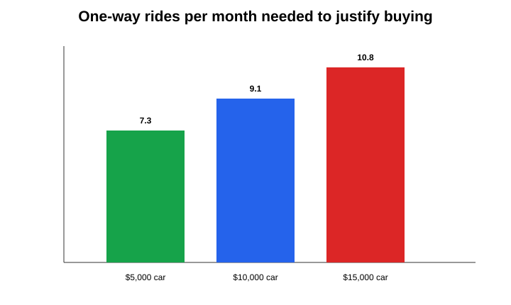
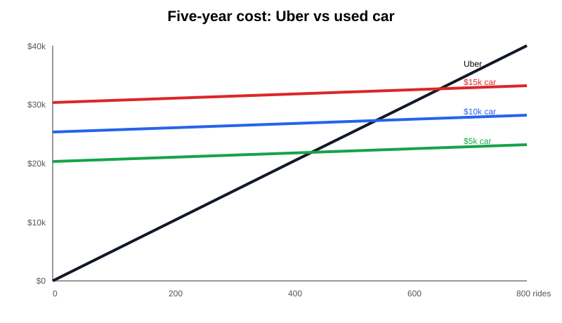

# Visual results

## When does buying become cheaper?

[Open the break-even chart full size](analysis/figures/break-even-rides-per-month.svg)

The minimum whole one-way ride frequency is **8 rides per month** for a $5,000 car, **10** for a $10,000 car, and **11** for a $15,000 car.

## How the costs cross over five years

[Open the five-year cost chart full size](analysis/figures/five-year-cost-curves.svg)

Uber starts with no fixed ownership cost but increases with each ride. Each car starts with a substantial fixed cost and then rises more slowly. Your observed rate is approximately **4 one-way rides per month**, below all three purchase thresholds.
